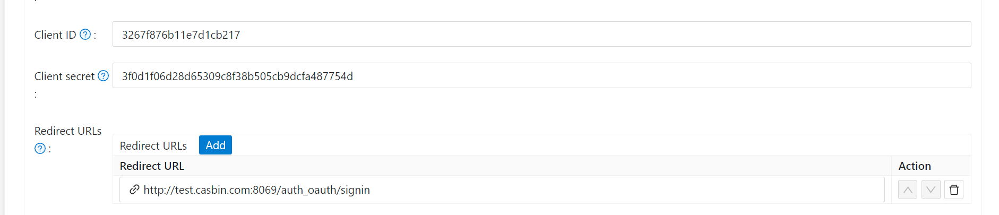
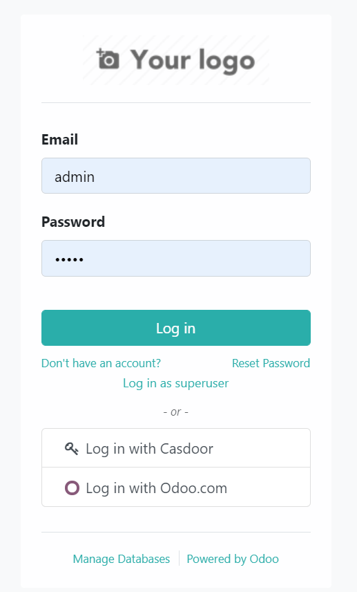

# odoo-casdoor-oauth

An Odoo module (`casdoor_oauth`) that lets users sign in to Odoo with [Casdoor](https://casdoor.ai). It extends Odoo's own `auth_oauth` module, so Casdoor shows up as a **Log in with Casdoor** button on the login page and users are created and matched the same way as with Odoo's built-in OAuth providers.

- Uses the OAuth 2.0 **authorization code flow**: the code is exchanged for an access token on the server with the client secret, and access tokens passed in the URL are never accepted.
- The `state` carries a random nonce bound to the browser's Odoo session, so a sign-in cannot be started in one browser and finished in another (no login CSRF).
- The user is read from Casdoor's `/api/userinfo` endpoint; tokens issued to other Casdoor applications are rejected. Odoo users are matched by their immutable Casdoor ID (`sub`), not by name or email.
- Works with Odoo 14.0 to 19.0 (tested on 18.0 and 19.0).

## Install

1. Copy the `casdoor_oauth` folder into one of your Odoo addons paths, e.g.:

    ```shell
    git clone https://github.com/casdoor/odoo-casdoor-oauth.git
    ./odoo-bin --addons-path=addons,../odoo-casdoor-oauth -d <database> -i casdoor_oauth
    ```

2. In Odoo, open **Apps**, remove the `Apps` filter, search for `Casdoor OAuth` and install it (or use `-i casdoor_oauth` as above). It installs Odoo's `auth_oauth` module as well.

## Configure

1. In Casdoor, open your application and add your Odoo URL followed by `/auth_oauth/signin` to **Redirect URLs**, e.g. `https://odoo.example.com/auth_oauth/signin`. Note its **Client ID** and **Client secret**.

    

2. In Odoo, open **Settings > Users & Companies > Casdoor** (as an administrator) and fill in:

    | Field         | Value                                                                                       |
    | ------------- | ------------------------------------------------------------------------------------------- |
    | Client ID     | Client ID of the Casdoor application                                                        |
    | Client Secret | Client secret of the Casdoor application                                                    |
    | Casdoor URL   | URL of your Casdoor server, e.g. `https://door.casdoor.com`. The authorization and user info URLs are filled in from it |
    | Allowed       | Check it to show the button on the login page                                               |
    | Scope         | `openid profile email` (the default), so that Odoo gets the user's name and email           |

    The same fields are on every provider under **Settings > Users & Companies > OAuth Providers** (developer mode): any provider with a Casdoor URL is handled as a Casdoor provider, so you can add several Casdoor servers or applications.

3. To let Casdoor users without an Odoo account sign in, enable **Settings > General Settings > Permissions > Customer Account: Free sign up** (`auth_signup.invitation_scope = b2c`); new users are created as portal users with their Casdoor email as login. Otherwise only users that already exist in Odoo, or that you invite, can sign in with Casdoor.

4. Sign out and click **Log in with Casdoor** on the login page.

    

## Upgrading from 1.0

Version 1.0 called a hard-coded token URL and verified tokens with a hard-coded key, so it did not work with real Casdoor servers. After upgrading, open **Settings > Users & Companies > Casdoor**, fill in the **Casdoor URL**, check the client secret and set the scope to `openid profile email`. The settings page under **Settings > Casdoor OAuth** is gone; the module no longer needs PyJWT.

## Development

The tests use Odoo's test runner:

```shell
./odoo-bin --addons-path=addons,../odoo-casdoor-oauth -d casdoor_test -i casdoor_oauth --test-enable --test-tags /casdoor_oauth --stop-after-init
```

## License

[Apache 2.0](LICENSE)
